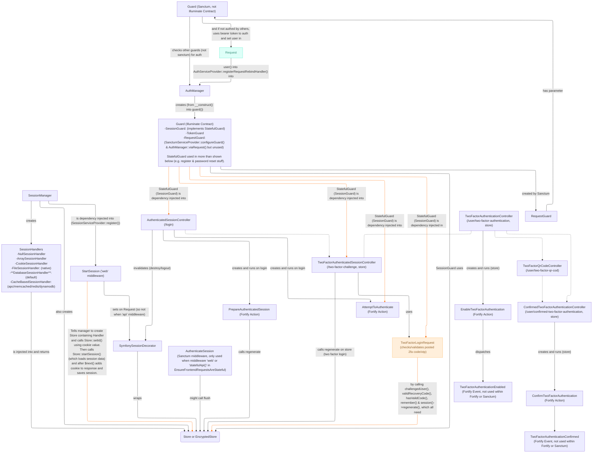

```mermaid
---
config:
  layout: elk
---
flowchart TD
    A["SessionManager"] -- creates --> n15["SessionHandlers<br>-NullSessionHandler<br>-ArraySessionHandler<br>-CookieSessionHandler<br>-FileSessionHandler: (native)<br>-**DatabaseSessionHandler**: (default)<br>-CacheBasedSessionHandler: (apc/memcached/redis/dynamodb)"]
    A -- also creates --> B("Store or EncryptedStore")
    A -- is dependency injected into (SessionServiceProvider::register()) --> n2@{ label: "StartSession ('web' middleware)" }
    n2 -- "Tells manager to create Store containing Handler and calls Store::setId() using cookie value.<br>Then calls Store::startSession() (which loads session data) and after $next() adds cookie to response and saves session." --> B
    n2 -- sets on Request (so not when 'api' middleware) --> n3["SymfonySessionDecorator"]
    n3 -- wraps --> B
    n4["AuthenticatedSessionController<br>(/login)"] -- invalidates (destroy/logout) --> n3
    n5@{ label: "AuthenticateSession <br>(Sanctum middleware, only used when middleware 'web' or 'statefulApi()' in EnsureFrontendRequestsAreStateful)" } -- might call flush --> B
    n6["PrepareAuthenticatedSession (Fortify Action)"] -- calls regenerate --> B
    n4 -- creates and runs on login --> n6 & n22["AttemptToAuthenticate<br>(Fortify Action)"]
    n7["TwoFactorAuthenticatedSessionController<br>(/two-factor-challenge, store)"] -- calls regenerate on store (two factor login) --> B
    n8["TwoFactorAuthenticationController<br>(/user/two-factor-authentication, store)"] -- creates and runs (store) --> n9["EnableTwoFactorAuthentication (Fortify Action)"]
    n9 -- dispatches --> n10["TwoFactorAuthenticationEnabled <br>(Fortify Event, not used within Fortify or Sanctum)"]
    n7 -- uses --> n11["TwoFactorLoginRequest<br>(checks/validates posted 2fa code/otp)"]
    n8 -.- n7
    n8 -.-> n12["ConfirmedTwoFactorAuthenticationController<br>(/user/confirmed-two-factor-authentication, store)"] & n16["TwoFactorQrCodeController<br>(/user/two-factor-qr-cod)"]
    n12 -- creates and runs (store) --> n13["ConfirmTwoFactorAuthentication<br>(Fortify Action)"]
    n13 --> n14["TwoFactorAuthenticationConfirmed<br>(Fortify Event, not used within Fortify or Sanctum)"]
    n11 -- "by calling challengedUser(), validRecoveryCode(), hasValidCode(), remember() &amp; session()-&gt;regenerate(), which all need" --> B
    n15 -- is injected into and returns --> B
    n4 -.-> n7
    n16 -.-> n12
    n17["Request"] -- user() into AuthServiceProvider::registerRequestRebindHandler() into --> n18["AuthManager"]
    n18 -- creates (from __construct() into guard()) --> n19["Guard (Illuminate Contract)<br>-SessionGuard: (implements StatefulGuard)<br>-TokenGuard<br>-RequestGuard: (SanctumServiceProvider::configureGuard() &amp; AuthManager::viaRequest() but unused)<br><br>StatefulGuard used in more than shown below (e.g. register &amp; password reset stuff)."]
    n19 -- SessionGuard uses --> B
    n19 -- created by Sanctum --> n20["RequestGuard"]
    n20 -- has parameter --> n21["Guard (Sanctum, not Illuminate Contract)"]
    n21 -- checks other guards (not sanctum) for auth --> n18
    n21 -- and if not authed by others, uses bearer token to auth and set user in --> n17
    n19 -- StatefulGuard (SessionGuard) is dependency injected into --> n4 & n7 & n22
    n19 -- StatefulGuard (SessionGuard) is dependency injected in --> n11
    n2@{ shape: rect}
    n5@{ shape: rect}
    n11:::Peach
    n17:::Aqua
classDef Peach stroke-width:1px, stroke-dasharray:none, stroke:#FBB35A, fill:#FFEFDB, color:#8F632D
classDef Aqua stroke-width:1px, stroke-dasharray:none, stroke:#46EDC8, fill:#DEFFF8, color:#378E7A
linkStyle 3 stroke:#FF6D00,fill:none
linkStyle 20 stroke:#FF6D00,fill:none
linkStyle 31 stroke:#FF6D00,fill:none
linkStyle 32 stroke:#FF6D00,fill:none
linkStyle 33 stroke:#FF6D00,fill:none
linkStyle 34 stroke:#FF6D00,fill:none
```
