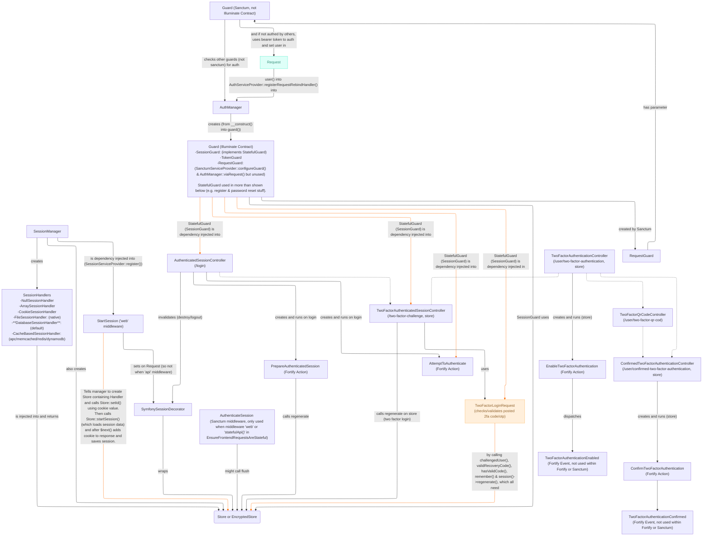

[](https://packagist.org/packages/everware/laravel-fortify-sanctum)

# Laravel Fortify Sanctum integration
This package solves a few things.
1. Mainly, it makes Laravel Fortify give out Sanctum access tokens on login instead of session cookies, without the need to add or overwrite routes 
   and while keeping all Fortify functionality intact (like 2FA, password confirmation and registration).
1. It optionally allows you to use different route middleware (groups) than 'web', so you can use the 'api' middleware group for example.
1. It does so by removing the required use of cookies within Fortify, making the Fortify routes/authentication "stateless" (-ish)*.
   This is valuable when working with environments that disallow the use of cookies or sessions.

\* The use of sessions is not completely removed because it is required for the two factor authentication and password confirmation actions within Fortify.

# Setup
First follow the [Laravel Fortify install guide](https://laravel.com/docs/12.x/fortify#installation)  
and follow the [Laravel Sanctum install guide](https://laravel.com/docs/12.x/sanctum#installation).  
Then install the package:
```bash
composer require everware/laravel-fortify-sanctum
```

Set `config/fortify.php 'guard'` to:
```php
'guard' => 'fortify-sanctum', // originally: 'web',
```

Finally, set `config/fortify.php 'middleware' to either:
```php
// If the middleware (group) does not contain StartSession, add StartTemporarySessionMiddleware and AddAuthTokenMiddleware.
['api', StartTemporarySessionMiddleware::class, AddAuthTokenMiddleware::class],
// Or, if the middleware (group) contains StartSession (like 'web'), only add our AddAuthTokenMiddleware.
['web', AddAuthTokenMiddleware::class],

// Add the imports at the top of the file:
use Everware\LaravelFortifySanctum\Http\Middleware\StartTemporarySessionMiddleware;
use Everware\LaravelFortifySanctum\Http\Middleware\AddAuthTokenMiddleware;
```

**That's it!**

## Custom user provider
If you use a custom user provider, overwrite our auth guard by adding this to `config/auth.php 'guards'`:
```php
'fortify-sanctum' => [
    'driver' => 'fortify-sanctum',
    'provider' => 'users', // Your custom provider here.
],
```

# Usage
## Added 'device_name' field
First, Fortifys `/login` and `/two-factor-challenge` routes now also require a 'device_name' field, so make sure you add this to your post requests.  
We suggest something like: `{ email, password, device_name: window.navigator.userAgent }` in the browser or ```{ email, password, device_name: `${Device.deviceName} (${Device.modelName})` }``` using Expo Device (React Native).
## Token response, two factor & temp session
When you make a successful request to the Fortify login route, you will receive Fortifys original JSON response (e.g. `{two_factor: false}`).  
If the users 2fa is disabled, thus successfully logging in, you will also receive an 'Auth-Token' HTTP header containing the newly generated Sanctum access token.  
When making use of **StartTemporarySessionMiddleware**; if the users 2fa is enabled, you will receive a 'Temporary-Session-ID' HTTP header (instead of Set-Cookie)
along with the response data `{two_factor: true}`.  
You can then make a post request containing the users OTP 'code' and the new 'device_name' field (see above) to `/two-factor-challenge` with this session id value in a 'Temporary-Session-ID' HTTP header.  
Note that the session id is regenerated on every request, so if for example the request to `/two-factor-challenge` fails in any way (e.g. 422 validation),
that response will contain a new 'Temporary-Session-ID' HTTP header which you will need use in the next request (the old id is now obsolete).
## Password confirmation
When not making use of StartTemporarySessionMiddleware; the password confirmation functionality works as it does normally.  
When making use of **StartTemporarySessionMiddleware**; the same 'Temporary-Session-ID' HTTP header functionality as described above 
is used with requests to `/user/confirm-password` and the response header value should be passed to whatever consecutive password-confirm-required route.  
Again, note the regeneration mentioned above.

## Bam! You're done, no custom routes required.

# Testing
If you want your Feature tests to use Sanctum access tokens as auth
(if that's what you use for your APIs auth, you should strive to have your tests be as similar to production as possible),
you can add `use SetUpFortifySanctumTests` to your TestCase class or your feature test class(es) (for pest feature test files add `uses(SetUpFortifySanctumTests::class);`)  
and add the import `use Everware\LaravelFortifySanctum\Tests\Concerns\SetUpFortifySanctumTests;` at the top of the file.  
Now, when you call `$this->actingAs($user)` in your tests, it will create and use Sanctum access tokens instead of session cookies*.  
\* Laravel doesn't originally use actual cookies when running `actingAs()` but rather sets that user on a singleton Auth guard.

# Troubleshooting
Make sure no Laravel Breeze or Starter Kit auth routes conflict with the Fortify routes.  
Make sure your User model implements trait `use HasApiTokens` (and `use TwoFactorAuthenticatable` if you want 2FA) as per [Sanctum's requirements](https://laravel.com/docs/12.x/sanctum#issuing-api-tokens). 

# Flowchart
How Laravel Fortify works in combination with Laravel Sanctum is quite complex, so I've created a model which visualizes the main parts of the combined architecture:  

